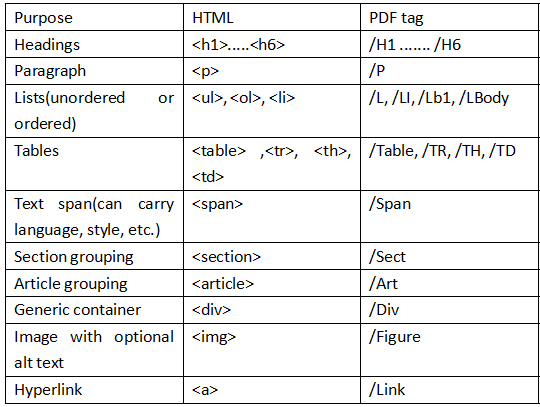

## Introcution {#structure}

In digital accessibility, clear structure is essential. This includes:

  1. Logical structure. Well-organized content using clear headings, paragraphs and logical flow of text. 
  2. Semantic structure. Correct use of HTML or PDF tags that describe the meaning and role of each element.

Both are required to make content accessible.

## Logical structure

1. Order content in a clear and logical order. 

2. Add appropriate heading level syntax (eg. `#`,`##`) to each section, and number the content if needed for clearer structure. 

3. After generating output, check if headings follow right logical order. Avoid skipped levels (eg. jumping from `H1` to `H3`) or placing a higher-level heading inside lower-level one.

4. Use tools to verify that headings and overall structure follow logical rule. Make andy suggested corrections

### Heading Syntax 

In Quarto, there are six heading levels.

```r
# Heading level 1
## Heading level 2
### Heading level 3
#### Heading level 4
##### Heading level 5
###### Heading level 6
```
## Semantic Structure {#structure-semantic}

Semantic structure uses proper markup to describe function or role of content elements, making it easier for screen readers to interpret them correctly. The below table shows the tags for HTML and PDF documents. Because these are not immediately evident for those who do not use screen readers, use tools to check that they are in place. Rendering an output in Quarto will result in the proper semantic structure.

{width="60%"}


