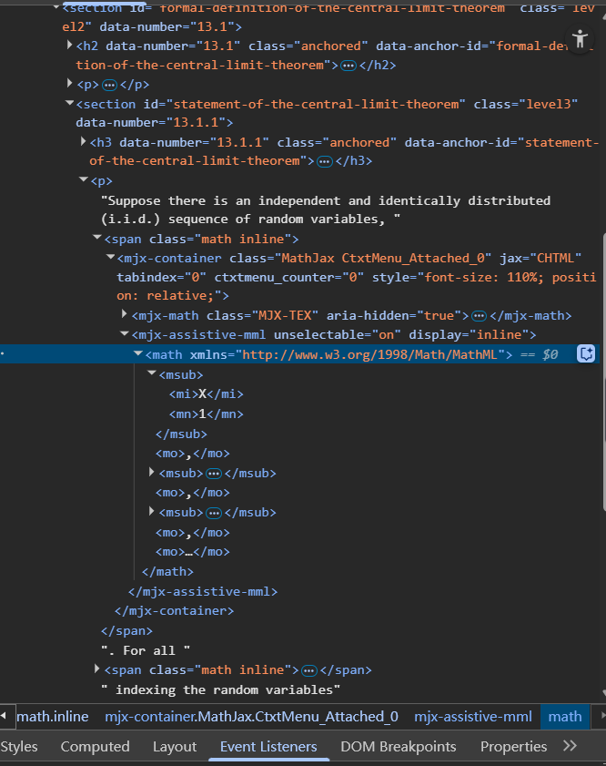
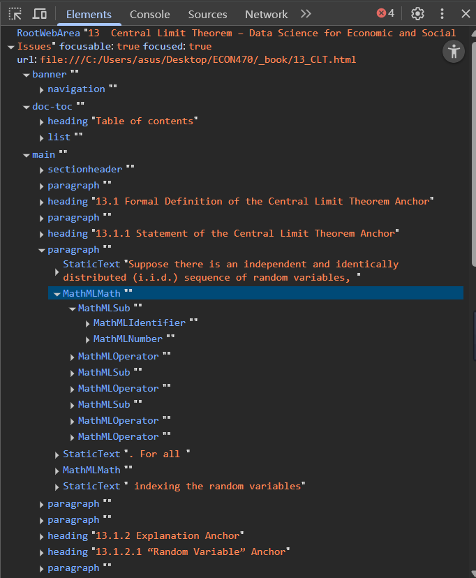

## Introduction {#math_1}

When LaTeX math is rendered properly in HTML, most modern screen readers can read the content as mathematical expressions, not just as plain text.

1. Write math expression using valid LaTeX syntax. For inline math, use:`$x^2 + y^2 = z^2$`. For block math, use: `$$E = mc^2$$.

2. Configure your Quarto (or R Markdown) file to use Mathjax to compile the math in `yml` file:

``` yaml
format:
  html:
    math: mathjax
```

3. When the output is generated, review all math expressions to ensure they are rendered properly. If an expression fails, make sure you are using correct syntax in your math code. If that still does not work, you can experiment with a different rendering engine, such as MathML.


## Verify that the Math is Accessible

There are two simple ways to check if the math content is accessible.

1.  Test with a screen reader. If the screen reader reads "equation," "x squared," etc. then it is working correctly. 

* [Jaws](https://portal.freedomscientific.com/SponsoredSoftware)

* [NVDA](https://www.nvaccess.org/download/)

2.  Inspect the HTML page. Open check tools or Elements in your browser and check for `<math>` elements, `role= "math"`, or `aria-label="..."` attributes. These are signs that MathJax has rendered the math in an accessible way. You can *switch to Accessibility* tree with semantic structure to inspect for accessibility. 


{width="80%"} 

{width="80%"}


