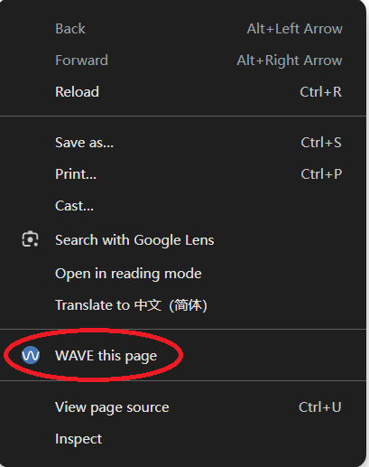
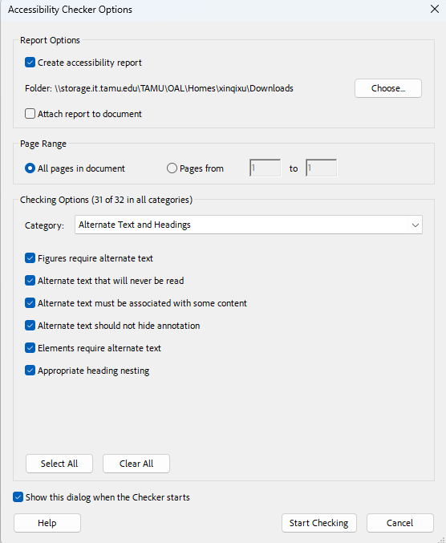
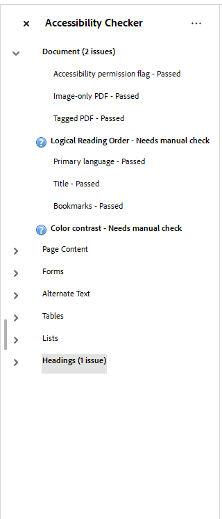
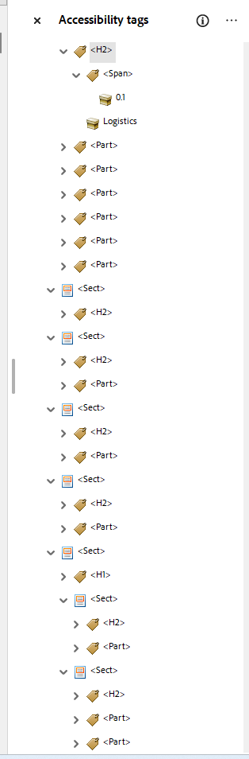
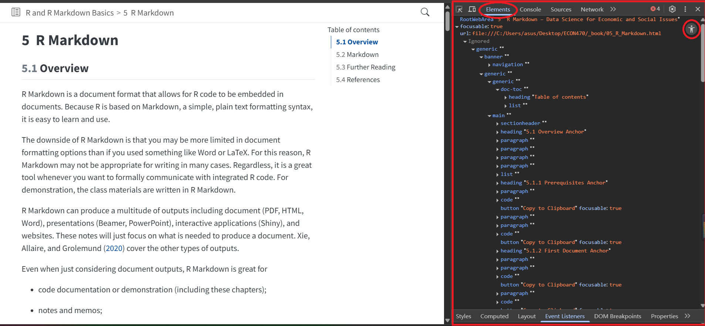

## Check for Digital Accessibility Issues {#checker}

Once your files are complete, run accessibility checks using the tools below to identify and fix potential issues.

## HTML Accessibility Check Tools

### WAVE

Recommened tool - covers a wide range of accessibility checks. And it's visualized, offering code(you can click `code` in the issues to see it's relative code and `reference` to see the details(include it's meaning, how to fix it, algorithm in English and Standards and Guidelines which are very helpful for you to understand the issues and it's relative solutions) of those Alerts or Error)

1. Install: Click [here](https://wave.webaim.org/extension/) to add the WAVE browser extension

2. How to Use:

(1) Open the HTML file you want to check

(2) Open Developer Tools, Press `Ctrl + Shift + I` or Right click the page and choose "WAVE this page" {width="40%"}

(3) Explore WAVE: Watch the offical walkthrough by clicking [here](https://www.youtube.com/watch?v=ITUDiTgAZY0)

Summary:

Details:

Reference:

(4) If you're checking a local HTML file, you must allow WAVE to access local files: Open your browser's Extensions page → Click `Manage Extensions` → Find WAVE and click Details → Toggle on "Allow access to file URLs"

{width="40%"}

### axe DevTools Another accessibility checker, integrated into browser dev tools.

1.  Install: Search for "axe DevTools" in the Chrome Web Store and add the extension.

2.  How to Use:

<!-- -->

(1) Right-click your page and select Inspect

(2) In Developer Tools, go to the "axe DevTools" tab and then choose `Scan full page` {width="40%"} {width="40%"}

(3) If you're checking local HTML file, make sure to allow axe DevTools to access file URLs - same process as WAVE.

### YuJa Panorama

.......

### Other Tools

1.Accessibility Insights fo Web Accessibility Insights for Web is a brower extension developed by Microsoft to evaluate web accessibility. It offers fast automated checks and guided manual assessments. [Website](https://accessibilityinsights.io/)

2.ARC Toolkit ARC Toolkit is a Chrome Developer Tools extension for auditing web accessibility. It supports manual inspection of HTML structure, ARIA attributes,a and color contrast. Available on the Chrome Web Store.

3.tota11y tota11y is a visual accessibility tool. It overlays visual indicators on web pages to help identify accessibility issues like headings, alt text, and labels. [Website](https://github.com/jdan/tota11y)

### Notes

To learn how to fix each issue, please go to corresponding section.

## PDF Accessibility Check

### Adobe Acrobat

If you're working with PDF files, use Adobe Acrobat's Accessibility Checker to identify and fix accessibility issues.

1.  Run Accessibility Checker in Adobe Acrobat

Steps:

(1) Open your PDF in Adobe Acrobat

(2) Go to the Tools tab and find Accessibility Check

(3) Click `Start Checking`

{wdith="30%"}

A report will appear on the left showing all issues

2.  View and understand issues

To check the details of each issue: Click on the issues listed in the report panel

{width="20%"}

Right-click to see more options.

Click `Explain` to read the [official Adobe explanation](https://helpx.adobe.com/acrobat/using/create-verify-pdf-accessibility.html)

Click Show in Tags Panel & Content Panel to view details

{wdith="20%"}

To learn how to fix each issue, please go to corresponding section.

#### Resources:

[Adobe Acrobat: Accessibility, tags and reflow](https://helpx.adobe.com/acrobat/using/create-verify-pdf-accessibility.html)

### PAC Accessibility Checker

Click [here](https://pac.pdf-accessibility.org/en) to download

### Learn to use Elements

Elements is a developer tool built in your browser. Elements is not strictly could considered as accessibility check tools, but It's a very powerful tool for you to access and debug accessibility issues.

There's 2 mode of Element: the normal one and the accessibility panel. We recommend you to use accessibility panel directly to inspect elements.

The Elements panel presents every part of wbepage, which include tag, contents, styles etc. Developer could use it to check the page's structure, function, etc. And Accessibility panel shows whole accessibility tree for the page. The tag tree here is very semantic and easy to understand.You can easily read the structure and function etc for each content you wrote. Cooperate with other accessibility check tools will make you digital accessibility work efficient and accurate. (Find issues in check tools, inspect elements to find and understand the issues)

Steps: 

1. Right click in the page you want to check

2. choose `inspect`

3. you can find "Element" on the right side panel, click into it.

4. then switch to "Accessibility panel" (click accessibility icon on the right head corner).  

{width=40%}

